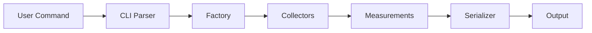
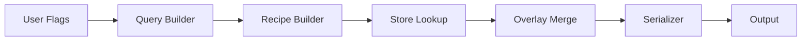
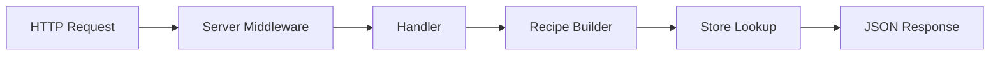

# Cloud Native Stack Architecture

This directory contains architecture documentation for the Cloud Native Stack (CNS) tooling.

## Components

- **[CLI Architecture](cli.md)** - Architecture of the `eidos` command-line tool for capturing system snapshots and generating configuration recipes
- **[API Server Architecture](api-server.md)** - Architecture of the HTTP API server for serving configuration recommendations

## Overview

Cloud Native Stack provides two complementary interfaces for system configuration management:

### CLI Tool (`eidos`)
A command-line interface for direct interaction with system configuration:
- **Snapshot Command**: Captures comprehensive system configuration
- **Recipe Command**: Generates optimized configuration recommendations

### API Server (`eidos-api-server`)
An HTTP REST API for programmatic access to configuration recommendations:
- **Recipe Endpoint**: Serves configuration recommendations via HTTP
- **Health/Metrics**: Kubernetes-ready observability endpoints

## Key Design Principles

1. **Separation of Concerns**: CLI and API server share core packages but maintain distinct entry points
2. **Concurrent Collection**: System measurements collected in parallel using errgroup
3. **Pluggable Collectors**: Factory pattern enables testing and extensibility
4. **Format Flexibility**: Multiple output formats (JSON, YAML, table) via serializer abstraction
5. **Production Ready**: Rate limiting, metrics, graceful shutdown, and panic recovery
6. **Semantic Versioning**: Version-aware recipe matching with precision control

## Shared Core Packages

Both components leverage shared functionality:

```
pkg/
├── collector/      # System data collection (OS, K8s, GPU, SystemD)
├── measurement/    # Data model for collected metrics
├── recipe/         # Recipe building and query matching
├── version/        # Semantic version parsing and comparison
├── serializer/     # Output formatting (JSON, YAML, table)
├── logging/        # Structured logging
└── server/         # HTTP server infrastructure (API only)
```

## Data Flow

### CLI Snapshot Flow


### CLI Recipe Flow


### API Recipe Flow


See individual architecture documents for detailed diagrams and component interactions.
