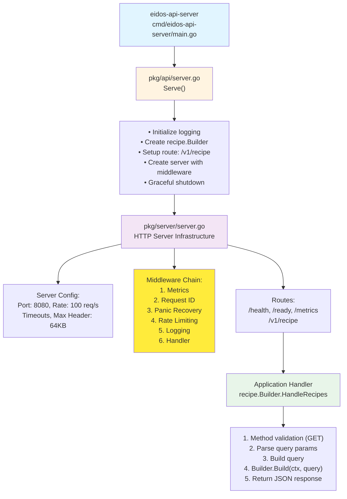
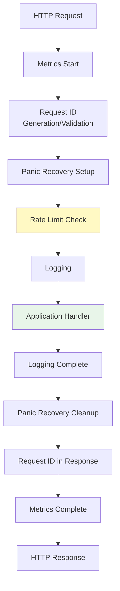

# API Server Architecture

The `eidos-api-server` provides HTTP REST API access to Cloud Native Stack configuration recipe generation capabilities.

## Overview

The API server is a production-ready HTTP service built on Go's `net/http` with middleware for rate limiting, metrics, request tracking, and graceful shutdown. It exposes recipe generation functionality via RESTful endpoints.

## Architecture Diagram



## Request Flow

### Complete Request Flow with Middleware

```mermaid
flowchart TD
    A["HTTP Client<br/>GET /v1/recipe?os=ubuntu&gpu=h100"] --> M1
    
    M1["1. Metrics Middleware<br/>• Start timer<br/>• Increment in-flight counter<br/>• Wrap response writer<br/>• Record duration & count"] --> M2
    
    M2["2. Request ID Middleware<br/>• Extract X-Request-Id<br/>• Generate UUID if missing<br/>• Store in context<br/>• Add to response header"] --> M3
    
    M3["3. Panic Recovery<br/>• Wrap in defer/recover<br/>• Log errors<br/>• Return 500 on panic"] --> M4
    
    M4["4. Rate Limit Middleware<br/>• Check rateLimiter.Allow()<br/>• Return 429 if exceeded<br/>• Add rate limit headers"] --> M5
    
    M5["5. Logging Middleware<br/>• Log request start<br/>• Capture status<br/>• Log completion"] --> H
    
    H["6. Application Handler<br/>recipe.Builder.HandleRecipes"] --> H1
    
    H1["A. Method Validation<br/>(GET only)"] --> H2
    H2["B. Parse Query Parameters<br/>os, osv, kernel, service<br/>k8s, gpu, intent, context"] --> H3
    H3["C. Validation<br/>• Validate enums<br/>• Parse versions<br/>• Return 400 on error"] --> H4
    H4["D. Build Recipe<br/>• Builder.Build(ctx, query)<br/>• Load store (cached)<br/>• Clone & merge measurements"] --> H5
    H5["E. Respond<br/>• Set Cache-Control<br/>• Serialize to JSON<br/>• Return 200 OK"] --> Z
    
    Z[JSON Response]
    
    style M1 fill:#e3f2fd
    style M2 fill:#e3f2fd
    style M3 fill:#ffebee
    style M4 fill:#fff9c4
    style M5 fill:#e3f2fd
    style H fill:#e8f5e9
    style H4 fill:#f3e5f5
```



## Component Details

### Entry Point: `cmd/eidos-api-server/main.go`

Minimal entry point:

```go
package main

import (
    "log"
    "github.com/NVIDIA/cloud-native-stack/pkg/api"
)

func main() {
    if err := api.Serve(); err != nil {
        log.Fatal(err)
    }
}
```

### API Package: `pkg/api/server.go`

**Responsibilities:**
- Initialize structured logging
- Create recipe builder
- Setup HTTP routes
- Configure server with middleware
- Handle graceful shutdown

**Key Features:**
- Version info injection via ldflags: `version`, `commit`, `date`
- Single route: `/v1/recipe` → recipe handler
- Server configured with production defaults
- Graceful shutdown on SIGINT/SIGTERM

### Server Infrastructure: `pkg/server/`

Production-ready HTTP server implementation with 10 files:

#### Core Components

**server.go** (217 lines)
- Server struct with config, HTTP server, rate limiter, ready state
- Functional options pattern for configuration
- Graceful shutdown using `signal.NotifyContext` and `errgroup`
- Default root handler listing available routes

**config.go** (72 lines)
- Configuration struct with sensible defaults
- Environment variable support (PORT)
- Timeout configuration (read, write, idle, shutdown)
- Rate limiting parameters

**middleware.go** (123 lines)
- Middleware chain builder
- Request ID middleware (UUID generation/validation)
- Rate limiting middleware (token bucket)
- Panic recovery middleware
- Logging middleware (structured logs)

**health.go** (60 lines)
- `/health` - Liveness probe (always returns 200)
- `/ready` - Readiness probe (returns 503 when not ready)
- JSON response with status and timestamp

**errors.go** (49 lines)
- Standardized error response structure
- Error codes (RATE_LIMIT_EXCEEDED, INTERNAL_ERROR, etc.)
- WriteError helper with request ID tracking

**metrics.go** (90 lines)
- Prometheus metrics:
  - `eidos_http_requests_total` - Counter by method, path, status
  - `eidos_http_request_duration_seconds` - Histogram by method, path
  - `eidos_http_requests_in_flight` - Gauge
  - `eidos_rate_limit_rejects_total` - Counter
  - `eidos_panic_recoveries_total` - Counter

**context.go** (8 lines)
- Context key type for request ID storage

**doc.go** (200 lines)
- Comprehensive package documentation
- Usage examples
- API endpoint descriptions
- Error handling documentation
- Deployment examples

#### Request Processing Pipeline



### Recipe Handler: `pkg/recipe/handler.go`

HTTP handler for recipe generation endpoint.

#### Handler Flow

```go
func (b *Builder) HandleRecipes(w http.ResponseWriter, r *http.Request) {
    // 1. Validate method (GET only)
    if r.Method != http.MethodGet {
        return 405
    }
    
    // 2. Parse query parameters
    query := parseQueryFromRequest(r)
    
    // 3. Validate query
    if err := query.Validate(); err != nil {
        return 400 with error details
    }
    
    // 4. Build recipe
    recipe, err := b.Build(r.Context(), query)
    if err != nil {
        return 500
    }
    
    // 5. Set cache headers
    w.Header().Set("Cache-Control", "public, max-age=300")
    
    // 6. Respond with JSON
    serializer.RespondJSON(w, http.StatusOK, recipe)
}
```

#### Query Parameter Parsing

| Parameter | Type | Validation | Example |
|-----------|------|------------|---------|
| `os` | OsFamily | Enum: ubuntu, cos, ALL | `os=ubuntu` |
| `osv` | Version | Semantic version | `osv=24.04` |
| `kernel` | Version | Semantic version | `kernel=6.8.0` |
| `service` | ServiceType | Enum: eks, gke, aks, self-managed, ALL | `service=eks` |
| `k8s` | Version | Semantic version | `k8s=v1.33.0` |
| `gpu` | GPUType | Enum: h100, gb200, a100, l40, ALL | `gpu=h100` |
| `intent` | IntentType | Enum: training, inference, ALL | `intent=training` |
| `context` | bool | true/false | `context=true` |

### Recipe Builder: `pkg/recipe/builder.go`

Shared with CLI - same logic as described in CLI architecture.

## API Endpoints

### Recipe Generation

**Endpoint**: `GET /v1/recipe`

**Query Parameters**:
- `os` - Operating system family
- `osv` - OS version
- `kernel` - Kernel version
- `service` - Kubernetes service type
- `k8s` - Kubernetes version
- `gpu` - GPU type
- `intent` - Workload intent
- `context` - Include context metadata (default: false)

**Response**: 200 OK

```json
{
  "request": {
    "os": "ubuntu",
    "gpu": "h100",
    "withContext": false
  },
  "matchedRuleId": [
    "OS: ubuntu *, Kernel: *, Service: *, K8s: *, GPU: h100, Intent: *, Context: false"
  ],
  "payloadVersion": "v1",
  "generatedAt": "2025-12-25T12:00:00Z",
  "measurements": [
    {
      "type": "os",
      "subtypes": [
        {
          "subtype": "grub",
          "data": {
            "hugepages": 5128,
            "hugepagesz": "2M"
          }
        }
      ]
    }
  ]
}
```

**Error Response**: 400 Bad Request

```json
{
  "code": "INVALID_REQUEST",
  "message": "invalid gpu type: must be one of h100, gb200, a100, l40, ALL",
  "requestId": "550e8400-e29b-41d4-a716-446655440000",
  "timestamp": "2025-12-25T12:00:00Z",
  "retryable": false
}
```

**Rate Limited**: 429 Too Many Requests

```json
{
  "code": "RATE_LIMIT_EXCEEDED",
  "message": "Rate limit exceeded",
  "details": {
    "limit": 100,
    "burst": 200
  },
  "requestId": "550e8400-e29b-41d4-a716-446655440000",
  "timestamp": "2025-12-25T12:00:00Z",
  "retryable": true
}
```

**Headers**:
- `X-Request-Id` - Unique request identifier
- `X-RateLimit-Limit` - Total requests allowed per second
- `X-RateLimit-Remaining` - Requests remaining in current window
- `X-RateLimit-Reset` - Unix timestamp when window resets
- `Cache-Control` - Caching policy (public, max-age=300)

### Health Check

**Endpoint**: `GET /health`

**Response**: 200 OK

```json
{
  "status": "healthy",
  "timestamp": "2025-12-25T12:00:00Z"
}
```

### Readiness Check

**Endpoint**: `GET /ready`

**Response**: 200 OK (ready) or 503 Service Unavailable (not ready)

```json
{
  "status": "ready",
  "timestamp": "2025-12-25T12:00:00Z"
}
```

### Metrics

**Endpoint**: `GET /metrics`

**Response**: Prometheus text format

```
# HELP eidos_http_requests_total Total number of HTTP requests
# TYPE eidos_http_requests_total counter
eidos_http_requests_total{method="GET",path="/v1/recipe",status="200"} 1234

# HELP eidos_http_request_duration_seconds HTTP request latency in seconds
# TYPE eidos_http_request_duration_seconds histogram
eidos_http_request_duration_seconds_bucket{method="GET",path="/v1/recipe",le="0.005"} 1000
eidos_http_request_duration_seconds_sum{method="GET",path="/v1/recipe"} 12.34
eidos_http_request_duration_seconds_count{method="GET",path="/v1/recipe"} 1234

# HELP eidos_http_requests_in_flight Current number of HTTP requests being processed
# TYPE eidos_http_requests_in_flight gauge
eidos_http_requests_in_flight 5

# HELP eidos_rate_limit_rejects_total Total number of requests rejected due to rate limiting
# TYPE eidos_rate_limit_rejects_total counter
eidos_rate_limit_rejects_total 42

# HELP eidos_panic_recoveries_total Total number of panics recovered in HTTP handlers
# TYPE eidos_panic_recoveries_total counter
eidos_panic_recoveries_total 0
```

### Root

**Endpoint**: `GET /`

**Response**: 200 OK

```json
{
  "service": "eidos-api-server",
  "version": "v1.0.0",
  "routes": [
    "/v1/recipe"
  ]
}
```

## Usage Examples

### cURL Examples

```bash
# Basic recipe request
curl "http://localhost:8080/v1/recipe?os=ubuntu&gpu=h100"

# Full specification
curl "http://localhost:8080/v1/recipe?os=ubuntu&osv=24.04&kernel=6.8&service=eks&k8s=v1.33&gpu=gb200&intent=training&context=true"

# With request ID
curl -H "X-Request-Id: 550e8400-e29b-41d4-a716-446655440000" \
  "http://localhost:8080/v1/recipe?os=ubuntu&gpu=h100"

# Health check
curl http://localhost:8080/health

# Readiness check
curl http://localhost:8080/ready

# Metrics
curl http://localhost:8080/metrics
```

### Client Libraries

**Go Client**:

```go
import (
    "encoding/json"
    "fmt"
    "net/http"
    "net/url"
)

func getRecipe(os, gpu string) (*Recipe, error) {
    baseURL := "http://localhost:8080/v1/recipe"
    params := url.Values{}
    params.Add("os", os)
    params.Add("gpu", gpu)
    
    resp, err := http.Get(baseURL + "?" + params.Encode())
    if err != nil {
        return nil, err
    }
    defer resp.Body.Close()
    
    if resp.StatusCode != http.StatusOK {
        return nil, fmt.Errorf("unexpected status: %d", resp.StatusCode)
    }
    
    var recipe Recipe
    if err := json.NewDecoder(resp.Body).Decode(&recipe); err != nil {
        return nil, err
    }
    
    return &recipe, nil
}
```

**Python Client**:

```python
import requests

def get_recipe(os, gpu):
    url = "http://localhost:8080/v1/recipe"
    params = {"os": os, "gpu": gpu}
    
    response = requests.get(url, params=params)
    response.raise_for_status()
    
    return response.json()

# Usage
recipe = get_recipe("ubuntu", "h100")
print(f"Matched {len(recipe['matchedRuleId'])} rules")
```

## Kubernetes Deployment

### Deployment Manifest

```yaml
apiVersion: apps/v1
kind: Deployment
metadata:
  name: eidos-api-server
  namespace: cns-system
spec:
  replicas: 3
  selector:
    matchLabels:
      app: eidos-api-server
  template:
    metadata:
      labels:
        app: eidos-api-server
    spec:
      containers:
      - name: server
        image: ghcr.io/nvidia/eidos-api-server:v1.0.0
        ports:
        - containerPort: 8080
          name: http
        env:
        - name: PORT
          value: "8080"
        resources:
          requests:
            cpu: 100m
            memory: 128Mi
          limits:
            cpu: 500m
            memory: 512Mi
        livenessProbe:
          httpGet:
            path: /health
            port: http
          initialDelaySeconds: 10
          periodSeconds: 10
        readinessProbe:
          httpGet:
            path: /ready
            port: http
          initialDelaySeconds: 5
          periodSeconds: 5
---
apiVersion: v1
kind: Service
metadata:
  name: eidos-api-server
  namespace: cns-system
spec:
  selector:
    app: eidos-api-server
  ports:
  - port: 80
    targetPort: http
  type: ClusterIP
---
apiVersion: v1
kind: ServiceMonitor
metadata:
  name: eidos-api-server
  namespace: cns-system
spec:
  selector:
    matchLabels:
      app: eidos-api-server
  endpoints:
  - port: http
    path: /metrics
    interval: 30s
```

### Ingress with TLS

```yaml
apiVersion: networking.k8s.io/v1
kind: Ingress
metadata:
  name: eidos-api-server
  namespace: cns-system
  annotations:
    cert-manager.io/cluster-issuer: letsencrypt-prod
spec:
  tls:
  - hosts:
    - api.eidos.nvidia.com
    secretName: eidos-api-tls
  rules:
  - host: api.eidos.nvidia.com
    http:
      paths:
      - path: /
        pathType: Prefix
        backend:
          service:
            name: eidos-api-server
            port:
              number: 80
```

### HorizontalPodAutoscaler

```yaml
apiVersion: autoscaling/v2
kind: HorizontalPodAutoscaler
metadata:
  name: eidos-api-server
  namespace: cns-system
spec:
  scaleTargetRef:
    apiVersion: apps/v1
    kind: Deployment
    name: eidos-api-server
  minReplicas: 3
  maxReplicas: 10
  metrics:
  - type: Resource
    resource:
      name: cpu
      target:
        type: Utilization
        averageUtilization: 70
  - type: Pods
    pods:
      metric:
        name: eidos_http_requests_in_flight
      target:
        type: AverageValue
        averageValue: "50"
```

## Performance Characteristics

### Throughput
- **Rate Limit**: 100 requests/second per instance (configurable)
- **Burst**: 200 requests (configurable)
- **Target Latency**: p50 <10ms, p99 <50ms
- **Max Concurrent**: Limited by rate limiter

### Resource Usage
- **CPU**: ~50m idle, ~200m at 100 req/s
- **Memory**: ~100MB baseline, ~200MB at peak
- **Disk**: None (stateless, embedded recipe data)

### Scalability
- **Horizontal**: Fully stateless, linear scaling
- **Vertical**: Recipe store cached in memory (sync.Once)
- **Load Balancing**: Round-robin or least-connections

### Caching Strategy
- **Recipe Store**: Loaded once per process, cached globally
- **Client-Side**: 5-minute cache via Cache-Control header
- **CDN**: Recommended for public-facing deployments

## Error Handling

### Error Response Format

All errors follow a consistent JSON structure:

```json
{
  "code": "ERROR_CODE",
  "message": "Human-readable error message",
  "details": {"key": "value"},
  "requestId": "uuid",
  "timestamp": "2025-12-25T12:00:00Z",
  "retryable": true/false
}
```

### Error Codes

| Code | HTTP Status | Description | Retryable |
|------|-------------|-------------|-----------|
| `RATE_LIMIT_EXCEEDED` | 429 | Too many requests | Yes |
| `INVALID_REQUEST` | 400 | Invalid parameters | No |
| `METHOD_NOT_ALLOWED` | 405 | Wrong HTTP method | No |
| `INTERNAL_ERROR` | 500 | Server error | Yes |
| `SERVICE_UNAVAILABLE` | 503 | Not ready | Yes |

### Error Handling Strategy

1. **Validation Errors**: Return 400 with specific error message
2. **Rate Limiting**: Return 429 with Retry-After header
3. **Panics**: Recover, log, return 500
4. **Context Cancellation**: Return early, cleanup resources
5. **Resource Exhaustion**: Rate limiting prevents this

## Security

### Attack Mitigation

**Rate Limiting**:
- Token bucket algorithm prevents abuse
- Per-instance limit (shared across all clients)
- Configurable limits and burst

**Header Attacks**:
- 64KB header size limit
- 5-second header read timeout
- Prevents slowloris attacks

**Resource Exhaustion**:
- Request timeouts (read, write, idle)
- In-flight request limits
- Graceful shutdown prevents connection drops

**Input Validation**:
- Strict enum validation
- Version string parsing with bounds
- UUID validation for request IDs

### Production Considerations

**TLS**:
- Use reverse proxy (nginx, Envoy) for TLS termination
- Or add TLS support to server (future enhancement)

**Authentication**:
- Add API key middleware (future enhancement)
- Or use service mesh mTLS (Istio, Linkerd)

**Authorization**:
- Currently none (public API)
- Could add rate limits per API key

**Monitoring**:
- Prometheus metrics for observability
- Request ID tracking for distributed tracing
- Structured logging for debugging

## Monitoring & Observability

### Prometheus Metrics

**Request Metrics**:
- `eidos_http_requests_total` - Total requests by method, path, status
- `eidos_http_request_duration_seconds` - Request latency histogram
- `eidos_http_requests_in_flight` - Current active requests

**Error Metrics**:
- `eidos_rate_limit_rejects_total` - Rate limit rejections
- `eidos_panic_recoveries_total` - Panic recoveries

### Grafana Dashboard

Example queries:

```promql
# Request rate
rate(eidos_http_requests_total[5m])

# Error rate
rate(eidos_http_requests_total{status=~"5.."}[5m])

# Latency percentiles
histogram_quantile(0.99, rate(eidos_http_request_duration_seconds_bucket[5m]))

# Rate limit rejections
rate(eidos_rate_limit_rejects_total[5m])
```

### Alerting Rules

```yaml
groups:
- name: eidos-api-server
  rules:
  - alert: HighErrorRate
    expr: rate(eidos_http_requests_total{status=~"5.."}[5m]) > 0.05
    for: 5m
    annotations:
      summary: High error rate on eidos-api-server
  
  - alert: HighLatency
    expr: histogram_quantile(0.99, rate(eidos_http_request_duration_seconds_bucket[5m])) > 0.1
    for: 5m
    annotations:
      summary: High latency on eidos-api-server
  
  - alert: HighRateLimitRejects
    expr: rate(eidos_rate_limit_rejects_total[5m]) > 10
    for: 5m
    annotations:
      summary: High rate limit rejections
```

### Distributed Tracing

Request ID tracking enables correlation:

1. Client sends request with `X-Request-Id` header
2. Server logs all operations with request ID
3. Response includes same `X-Request-Id`
4. Client can correlate logs across services

Future: OpenTelemetry integration for full tracing

## Testing Strategy

### Unit Tests
- Handler validation logic
- Middleware functionality
- Error response formatting
- Query parsing

### Integration Tests
- Full HTTP request/response cycle
- Rate limiting behavior
- Graceful shutdown
- Health/ready endpoints

### Load Tests
- Sustained load at rate limit
- Burst handling
- Latency under load
- Memory stability

### Example Test

```go
func TestRecipeHandler(t *testing.T) {
    // Create test server
    builder := recipe.NewBuilder()
    handler := builder.HandleRecipes
    
    // Create test request
    req := httptest.NewRequest(
        "GET",
        "/v1/recipe?os=ubuntu&gpu=h100",
        nil,
    )
    w := httptest.NewRecorder()
    
    // Execute handler
    handler(w, req)
    
    // Verify response
    assert.Equal(t, http.StatusOK, w.Code)
    
    var resp recipe.Recipe
    err := json.Unmarshal(w.Body.Bytes(), &resp)
    assert.NoError(t, err)
    assert.Equal(t, "ubuntu", resp.Request.Os)
}
```

## Dependencies

### External Libraries
- `net/http` - Standard HTTP server
- `golang.org/x/time/rate` - Rate limiting
- `golang.org/x/sync/errgroup` - Concurrent error handling
- `github.com/prometheus/client_golang` - Prometheus metrics
- `github.com/google/uuid` - UUID generation
- `gopkg.in/yaml.v3` - Recipe store parsing
- `log/slog` - Structured logging

### Internal Packages
- `pkg/recipe` - Recipe building logic
- `pkg/measurement` - Data model
- `pkg/version` - Semantic versioning
- `pkg/serializer` - JSON response formatting
- `pkg/logging` - Logging configuration

## Build & Deployment

### Build Configuration

```makefile
VERSION ?= $(shell git describe --tags --always --dirty)
COMMIT ?= $(shell git rev-parse --short HEAD)
DATE ?= $(shell date -u +%Y-%m-%dT%H:%M:%SZ)

LDFLAGS := -X github.com/NVIDIA/cloud-native-stack/pkg/api.version=$(VERSION)
LDFLAGS += -X github.com/NVIDIA/cloud-native-stack/pkg/api.commit=$(COMMIT)
LDFLAGS += -X github.com/NVIDIA/cloud-native-stack/pkg/api.date=$(DATE)

go build -ldflags="$(LDFLAGS)" -o bin/eidos-api-server ./cmd/eidos-api-server
```

### Docker Image

```dockerfile
FROM golang:1.23-alpine AS builder
WORKDIR /app
COPY . .
RUN go build -ldflags="-X github.com/NVIDIA/cloud-native-stack/pkg/api.version=v1.0.0" \
    -o /bin/eidos-api-server ./cmd/eidos-api-server

FROM alpine:3.19
RUN apk --no-cache add ca-certificates
COPY --from=builder /bin/eidos-api-server /usr/local/bin/
EXPOSE 8080
ENTRYPOINT ["eidos-api-server"]
```

### Environment Variables

- `PORT` - Server port (default: 8080)
- Future: `RATE_LIMIT`, `RATE_LIMIT_BURST`, etc.

## Future Enhancements

### Short Term
1. **Authentication**: API key middleware
2. **CORS**: Cross-origin support for browser clients
3. **Compression**: gzip response compression
4. **TLS**: Native HTTPS support
5. **Versioned API**: Support /v2 with different responses

### Long Term
1. **OpenTelemetry**: Distributed tracing integration
2. **GraphQL**: Alternative query interface
3. **WebSocket**: Streaming updates
4. **gRPC**: Binary protocol option
5. **Multi-Tenancy**: Per-tenant rate limits and customization
6. **Recipe Caching**: Redis/Memcached for faster responses
7. **A/B Testing**: Feature flags for gradual rollouts
8. **Admin API**: Runtime config updates
