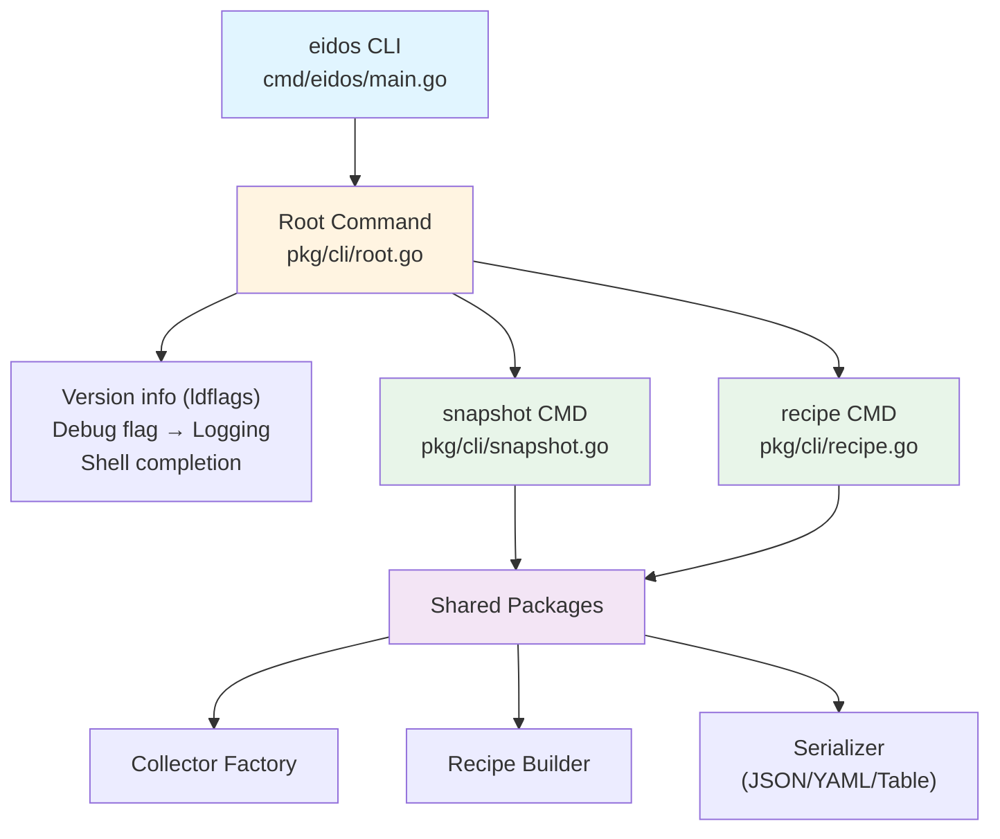
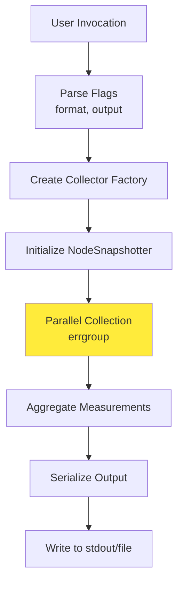
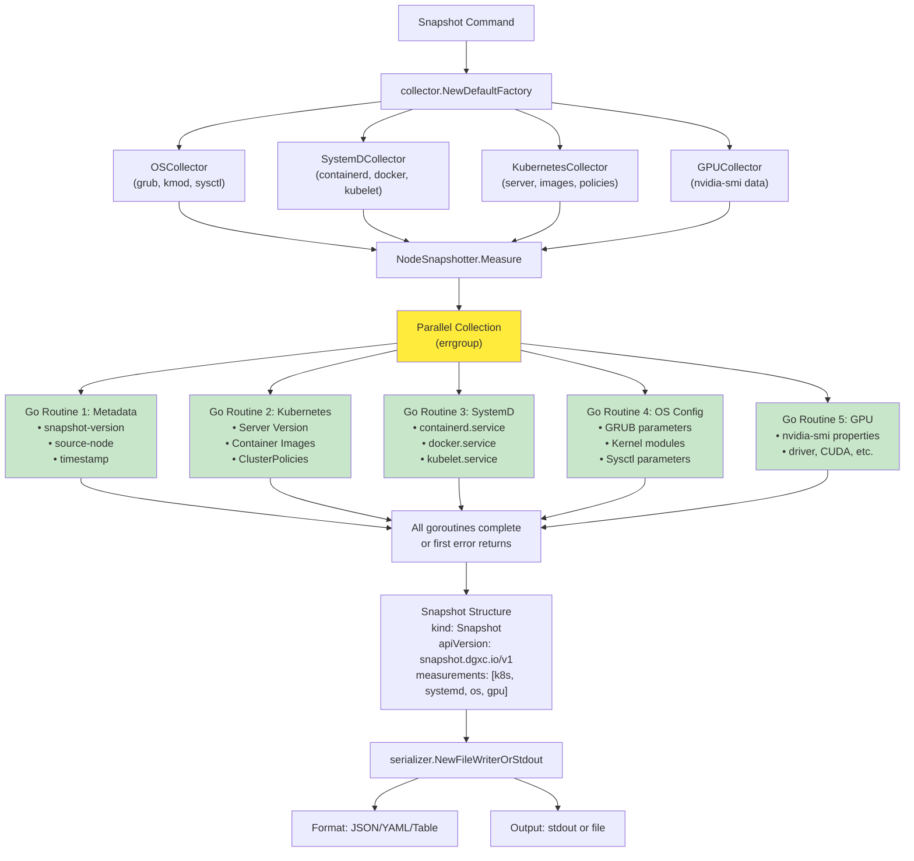
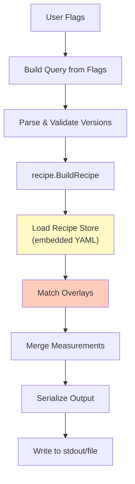
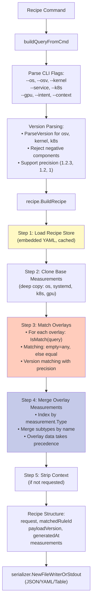

# CLI Architecture

The `eidos` CLI provides command-line access to Cloud Native Stack configuration management capabilities.

## Overview

The CLI is built on the [urfave/cli/v3](https://github.com/urfave/cli) framework and provides two main commands:
- `snapshot` - Capture system configuration
- `recipe` - Generate configuration recommendations

## Architecture Diagram



## Component Details

### Entry Point: `cmd/eidos/main.go`

Minimal entry point that delegates to the CLI package:

```go
package main

import "github.com/NVIDIA/cloud-native-stack/pkg/cli"

func main() {
    cli.Execute()
}
```

### Root Command: `pkg/cli/root.go`

**Responsibilities:**
- Command registration and routing
- Version information injection (via ldflags)
- Global flag handling (debug mode)
- Structured logging initialization

**Key Features:**
- Version info: `version`, `commit`, `date` (overridden at build time)
- Debug flag: `--debug` → Sets log level to debug
- Shell completion support
- Command listing for auto-completion

### Snapshot Command: `pkg/cli/snapshot.go`

Captures comprehensive system configuration snapshots.

#### Command Flow



#### Detailed Data Flow



#### Usage Examples

```bash
# Output to stdout in JSON format
eidos snapshot

# Save to file in YAML format
eidos snapshot --output system.yaml --format yaml

# Human-readable table format
eidos snapshot --format table
```

### Recipe Command: `pkg/cli/recipe.go`

Generates optimized configuration recipes based on environment parameters.

#### Command Flow



#### Detailed Data Flow



#### Recipe Matching Algorithm

The recipe matching uses a **rule-based query system** where overlays specify keys that must match the user's query:

```yaml
overlays:
  - key:
      service: eks          # Rule: must have service=eks
      os: ubuntu           # Rule: must have os=ubuntu
    types:
      - type: os
        subtypes:
          - subtype: grub
            data:
              BOOT_IMAGE: /boot/vmlinuz-6.8.0-1028-aws
```

**Matching Rules:**
1. **All** fields in the overlay key must be satisfied
2. Empty overlay field → matches anything (wildcard)
3. Empty query field → matches nothing (no match)
4. Version fields use semantic version equality with precision awareness

#### Usage Examples

```bash
# Basic recipe for Ubuntu with H100 GPU
eidos recipe --os ubuntu --gpu h100

# Full specification with all parameters
eidos recipe \
  --os ubuntu \
  --osv 24.04 \
  --kernel 6.8.0 \
  --service eks \
  --k8s v1.33.0 \
  --gpu gb200 \
  --intent training \
  --context \
  --format yaml \
  --output recipe.yaml

# Inference workload on GKE
eidos recipe --service gke --gpu a100 --intent inference
```

## Shared Infrastructure

### Collector Factory Pattern

The CLI uses the **Factory Pattern** for collector instantiation, enabling:
- **Testability**: Inject mock collectors for unit tests
- **Flexibility**: Easy to add new collector types
- **Encapsulation**: Hide collector creation complexity

```go
type Factory interface {
    CreateSystemDCollector() Collector
    CreateOSCollector() Collector
    CreateKubernetesCollector() Collector
    CreateGPUCollector() Collector
}
```

### Serializer Abstraction

Output formatting is abstracted through the `serializer.Serializer` interface:

```go
type Serializer interface {
    Serialize(data interface{}) error
}
```

Implementations:
- **JSON**: `encoding/json` with 2-space indent
- **YAML**: `gopkg.in/yaml.v3` 
- **Table**: `text/tabwriter` for columnar display

### Measurement Data Model

All collected data uses a unified `measurement.Measurement` structure:

```go
type Measurement struct {
    Type     Type      // os, k8s, systemd, gpu
    Subtypes []Subtype // Named collections of readings
}

type Subtype struct {
    Name    string                // grub, kmod, sysctl, server, image, etc.
    Data    map[string]Reading    // Key-value readings
    Context map[string]string     // Human-readable descriptions
}

type Reading struct {
    Value interface{}  // Actual value (int, string, bool, float64)
}
```

## Error Handling

### CLI Error Strategy

1. **Flag Validation**: User-friendly error messages for invalid flags
2. **Version Parsing**: Specific error types (ErrNegativeComponent, etc.)
3. **Collector Failures**: Log errors, continue with partial data where possible
4. **Serialization Errors**: Fatal - abort and report
5. **Exit Codes**: Non-zero exit code on any failure

### Example Error Messages

```bash
# Invalid version format
$ eidos recipe --osv -1.0
Error: error parsing recipe input parameter: os version cannot contain negative numbers: -1.0

# Unknown output format
$ eidos snapshot --format xml
Error: unknown output format: "xml"

# Missing required parameters
$ eidos recipe
# Still succeeds - generates base recipe with no overlays
```

## Performance Characteristics

### Snapshot Command

- **Parallel Collection**: All collectors run concurrently via `errgroup`
- **Typical Duration**: 100-500ms depending on cluster size
- **Memory Usage**: ~10-50MB for typical workloads
- **Scalability**: O(n) with number of pods/nodes for K8s collector

### Recipe Command

- **Store Loading**: Once per process (cached via `sync.Once`)
- **Typical Duration**: <10ms after initial load
- **Memory Usage**: ~5-10MB (embedded YAML + parsed structure)
- **Scalability**: O(m) with number of overlays (typically <100)

## Build Configuration

### Version Injection via ldflags

Build-time version information injection:

```makefile
VERSION ?= $(shell git describe --tags --always --dirty)
COMMIT ?= $(shell git rev-parse --short HEAD)
DATE ?= $(shell date -u +%Y-%m-%dT%H:%M:%SZ)

LDFLAGS := -X github.com/NVIDIA/cloud-native-stack/pkg/cli.version=$(VERSION)
LDFLAGS += -X github.com/NVIDIA/cloud-native-stack/pkg/cli.commit=$(COMMIT)
LDFLAGS += -X github.com/NVIDIA/cloud-native-stack/pkg/cli.date=$(DATE)

go build -ldflags="$(LDFLAGS)" -o bin/eidos ./cmd/eidos
```

## Testing Strategy

### Unit Tests
- Flag parsing and validation
- Version parsing and error handling
- Query building from command flags
- Serializer format selection

### Integration Tests
- Mock collectors for deterministic output
- Full command execution with fake factory
- Output format validation

### Example Test Structure

```go
func TestSnapshotCommand(t *testing.T) {
    // Create mock factory
    mockFactory := &MockFactory{
        k8s:     mockK8sCollector,
        systemd: mockSystemDCollector,
        os:      mockOSCollector,
        gpu:     mockGPUCollector,
    }
    
    // Execute snapshot with mock
    snapshotter := NodeSnapshotter{
        Factory: mockFactory,
        Serializer: &bytes.Buffer{},
    }
    
    err := snapshotter.Measure(ctx)
    assert.NoError(t, err)
}
```

## Dependencies

### External Libraries
- `github.com/urfave/cli/v3` - CLI framework
- `golang.org/x/sync/errgroup` - Concurrent error handling
- `gopkg.in/yaml.v3` - YAML parsing
- `log/slog` - Structured logging

### Internal Packages
- `pkg/collector` - System data collection
- `pkg/measurement` - Data model
- `pkg/recipe` - Recipe building
- `pkg/version` - Semantic versioning
- `pkg/serializer` - Output formatting
- `pkg/logging` - Logging configuration
- `pkg/snapshotter` - Snapshot orchestration

## Future Enhancements

### Potential Improvements
1. **Caching**: Cache snapshot results with TTL
2. **Differential Snapshots**: Compare two snapshots and show diff
3. **Filtering**: Allow filtering measurements by type/subtype
4. **Compression**: Compress large snapshots (gzip)
5. **Streaming**: Stream measurements for large datasets
6. **Validation**: Validate snapshots against expected schemas
7. **Import/Export**: Convert between different snapshot formats
8. **Plugins**: External collector plugins via RPC
